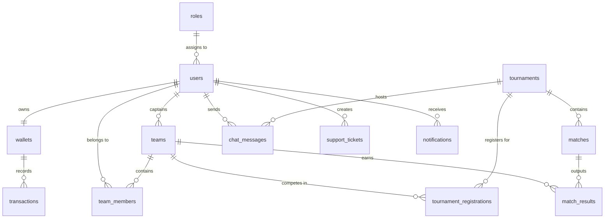

# 🎮 ESPORTS ARENA — Ultimate 4vs4 Tournament Hub

Welcome to **Esports Arena**, a high-fidelity, cyberpunk-themed web platform designed to host, coordinate, and execute 4vs4 gaming tournaments. This platform features a stateless JWT-secured authentication system, OTP verification via email, team management with captain and player roles, real-time match tracking, instant lobby chat, and a robust atomic virtual wallet system (with Razorpay sandbox integration) for managing deposits, registration entry fees, and prize distributions.

---

## 🎨 Promotional Media & Interactive Previews

The design language of Esports Arena is heavily inspired by modern cyberpunk aesthetics, utilizing neon glows, sleek glassmorphic overlays, and immersive micro-animations.

*   **Interactive Digital HTML Poster:** Open and view the customized interactive poster showcasing the platform details: [esports_arena_poster.html](file:///d:/project/gamebuild/esports_arena_poster.html)
*   **Static Promotional Graphic:** Preview the high-fidelity graphical poster directly: [esports_arena_poster.png](file:///d:/project/gamebuild/esports_arena_poster.png)

---

## 🚀 Key Modules & System Features

### 🔐 1. Authentication & Profile Management
*   **Stateless JWT Security:** Implements stateless sessions driven by **Spring Security** and JWT tokens stored client-side in the browser.
*   **BCrypt Hashing:** Passwords are encrypted using BCrypt cryptography.
*   **Two-Factor Mail OTP:** Sign-up registration and password recovery flows are verified using email OTP notifications sent via **Gmail SMTP**.
*   **Avatar Image Uploads:** Supports uploading custom profile pictures during registration. Uploads are processed as `multipart/form-data` and saved to `backend/uploads/avatars/`, with local path mapping and dynamic frontend preview logic.

### 💳 2. Atomic Virtual Wallet & Transactions
*   **Ledger System:** Tracks all financial actions atomically to avoid race conditions. Supported transaction types: `DEPOSIT`, `WITHDRAWAL`, `TOURNAMENT_FEE`, and `PRIZE`.
*   **Razorpay Integration:** Full order creation, client-side checkout integration, and backend signature verification (`HMAC-SHA256`) to handle sandbox deposits.
*   **Dynamic Balance Syncing:** Seamlessly updates the player header and profile dashboard balance in real-time when transactions are processed.

### 🏆 3. 4vs4 Tournament Engine & Teams
*   **Dynamic Team Formation:** Captains can create teams, generating unique join codes that player accounts can use to join the team.
*   **Entry Fee & Prize Pool:** Tournaments require wallet validation for registration. Supports automated prize pools, entry fees, and automated prize calculations (First, Second, Third, and per-kill rewards).
*   **Solo & Team Registration:** Support registering entire pre-formed teams, joining via invite codes, or registering solo for manual matching.
*   **Custom Brackets & Room Credentials:** Organizers can configure match rooms, issue lobby/room IDs and passwords, and declare final scores.

### 📡 4. Real-time Live Match Tracker & WebSockets
*   **Live Score Streaming:** Tracks pending, ongoing, and completed matches in real-time.
*   **WebSocket STOMP Broker:** Utilizes SockJS fallback transports to establish real-time chat rooms inside tournaments, and send match update broadcasts.
*   **Unread Notifications:** Real-time system messages and notification panel.

### 🛠️ 5. Admin Panel
*   **Manual Deposit Verification:** Approving offline or pending payments.
*   **User Moderation:** Ability to block and unblock users instantly.
*   **Tournament Control:** Create, reschedule (match timing updates), cancel, and update results of matches.
*   **Support Ticket Resolution:** Ticket dashboard with reply inputs to resolve player complaints.

---

## 🛠️ Technology Stack

| Layer | Component / Technology | Purpose |
| :--- | :--- | :--- |
| **Frontend** | [React 19](https://react.dev) with [TypeScript](https://www.typescriptlang.org) | Component-driven user interface structure |
| **Frontend Build Tool** | [Vite 8](https://vite.dev) | Fast HMR (Hot Module Replacement) and compilation |
| **Styling** | [Tailwind CSS v3](https://tailwindcss.com) & [Framer Motion](https://www.framer.com/motion/) | Cyberpunk dark design, layout, and page-level animations |
| **Icons** | [Lucide React](https://lucide.dev) | Unified, clean vector dashboard icons |
| **API Client** | [Axios](https://axios-http.com) | Interceptor-supported connection to backend REST endpoints |
| **Backend** | [Java 17](https://www.oracle.com/java/) with [Spring Boot 3.3.0](https://spring.io/projects/spring-boot) | Primary business logic, security, and controllers |
| **Security** | Spring Security & JWT | Stateless endpoint authentication and authorization filters |
| **Real-time Sync** | Spring WebSockets & STOMP | Real-time chat messaging and match updating |
| **Data Access** | Spring Data JPA (Hibernate ORM) | Database queries and schema object mapping |
| **Database** | [MySQL 8](https://www.mysql.com) | High-performance relational data store |
| **Migrations** | [Flyway](https://flywaydb.org) | Versioned database schema creation and tracking (`V1` to `V14`) |
| **Build Tool** | Maven | Backend package manager and compilation wrapper |

---

## 🗄️ Database Schema & Entities

The relational database is constructed and managed dynamically on application startup via Flyway SQL scripts. The relationships are structured as follows:



### Table Definitions & Script Locations
All Flyway migration scripts are located in: [backend/src/main/resources/db/migration/](file:///d:/project/gamebuild/backend/src/main/resources/db/migration)
1.  **`roles` & `users`:** Define user accounts, authorization privileges (Super Admin, Organizer, Player, Captain, etc.), avatar images, and Free Fire UID credentials. Ref: [V1__init_schema.sql](file:///d:/project/gamebuild/backend/src/main/resources/db/migration/V1__init_schema.sql)
2.  **`wallets` & `transactions`:** Manage balance ledgers, record deposits, entry fees, and prize payments atomically. Ref: [V4__wallet_transactions_schema.sql](file:///d:/project/gamebuild/backend/src/main/resources/db/migration/V4__wallet_transactions_schema.sql)
3.  **`teams` & `team_members`:** Organize 4vs4 squads, captains, invite codes, and membership lists. Ref: [V2__esports_modules_schema.sql](file:///d:/project/gamebuild/backend/src/main/resources/db/migration/V2__esports_modules_schema.sql) & [V5__add_invite_code_to_teams.sql](file:///d:/project/gamebuild/backend/src/main/resources/db/migration/V5__add_invite_code_to_teams.sql)
4.  **`tournaments` & `tournament_registrations`:** Handle tournament definitions, prize values, game parameters (mode, map), and team slots. Ref: [V6__tournament_registrations_schema.sql](file:///d:/project/gamebuild/backend/src/main/resources/db/migration/V6__tournament_registrations_schema.sql) & [V7__tournament_prize_distribution.sql](file:///d:/project/gamebuild/backend/src/main/resources/db/migration/V7__tournament_prize_distribution.sql)
5.  **`matches` & `match_results`:** Coordinate game room configurations, passwords, status updates, kill points, placement calculations, and result logs. Ref: [V3__matches_schema.sql](file:///d:/project/gamebuild/backend/src/main/resources/db/migration/V3__matches_schema.sql)
6.  **`otp_verifications`:** Temporary authentication store for validating email codes during sign-up and password reset. Ref: [V13__create_otp_verifications.sql](file:///d:/project/gamebuild/backend/src/main/resources/db/migration/V13__create_otp_verifications.sql)
7.  **`support_tickets` & `notifications`:** Manage client complaints/admin replies, and store custom system-wide read/unread notifications. Ref: [V14__support_and_notifications.sql](file:///d:/project/gamebuild/backend/src/main/resources/db/migration/V14__support_and_notifications.sql)

---

## 📂 Project Directory Structure

```text
ESPORTS-ARENA/
├── backend/
│   ├── src/main/java/com/esports/
│   │   ├── Application.java (Main entry point)
│   │   ├── config/ (Spring Security, JWT, WebSockets Configurations)
│   │   ├── controller/ (REST Endpoints)
│   │   ├── dto/ (Data Transfer Objects)
│   │   ├── entity/ (JPA Database Entities)
│   │   ├── repository/ (Spring Data Repositories)
│   │   └── service/ (Core Business Logic)
│   ├── src/main/resources/
│   │   ├── application.yml (Database, SMTP & Razorpay Configurations)
│   │   └── db/migration/ (Flyway Versioned SQL Scripts)
│   └── pom.xml (Maven Dependency Build file)
│
├── frontend/
│   ├── public/ (Static assets/logos)
│   ├── src/
│   │   ├── App.tsx (Global navigation layout, context mapping & router)
│   │   ├── main.tsx (React DOM mounting script)
│   │   ├── components/ (Reusable UI panels, buttons & form fields)
│   │   ├── pages/ (Dashboard, Wallet, Admin views, Signup, Login)
│   │   ├── services/ (Axios configurations & service adapters)
│   │   ├── styles/ (Tailwind styles config)
│   │   └── types/ (TypeScript interfaces)
│   ├── tailwind.config.js (Custom layout variables)
│   └── package.json (Vite dependencies & scripts)
│
└── README.md
```

---

## 🚀 Local Installation & Setup Guide

### 📋 Prerequisites
Ensure you have the following installed on your machine:
*   **Java 17 Development Kit (JDK)**
*   **Node.js** (v18.x or above)
*   **npm** or **Yarn** package manager
*   **MySQL Server 8.0**
*   **Maven** (for compiling Spring Boot)

---

### Step 1: Configure & Initialize the Database
1.  Launch your MySQL command line client or graphical interface (e.g., MySQL Workbench).
2.  Create the backend database:
    ```sql
    CREATE DATABASE esports_db;
    ```
3.  Open the backend configurations at [application.yml](file:///d:/project/gamebuild/backend/src/main/resources/application.yml). Update your database credentials (username and password) under `spring.datasource`:
    ```yaml
    spring:
      datasource:
        url: jdbc:mysql://localhost:3306/esports_db?createDatabaseIfNotExist=true&useSSL=false&serverTimezone=UTC&allowPublicKeyRetrieval=true
        username: YOUR_MYSQL_USERNAME
        password: YOUR_MYSQL_PASSWORD
    ```

---

### Step 2: Configure Environment Credentials
Inside [application.yml](file:///d:/project/gamebuild/backend/src/main/resources/application.yml), customize the following integrations:
1.  **Gmail SMTP** (for registration & forgot-password verification):
    ```yaml
    spring:
      mail:
        host: smtp.gmail.com
        port: 587
        username: YOUR_EMAIL@gmail.com
        password: YOUR_APP_SPECIFIC_PASSWORD
    ```
2.  **Razorpay Integration Keys** (for sandbox test wallet payments):
    ```yaml
    app:
      razorpay:
        key-id: YOUR_RAZORPAY_KEY_ID
        key-secret: YOUR_RAZORPAY_KEY_SECRET
    ```

---

### Step 3: Run the Backend (Spring Boot Server)
1.  Open a terminal window and navigate to the backend directory:
    ```bash
    cd backend
    ```
2.  Compile the source code and launch the Spring Boot server:
    ```bash
    mvn clean spring-boot:run
    ```
    *The backend server will bootstrap on **`http://localhost:8080`**. Flyway will execute the migration scripts sequentially, populating all database tables.*

    **Main entry class link:** [Application.java](file:///d:/project/gamebuild/backend/src/main/java/com/esports/Application.java)

---

### Step 4: Run the Frontend (Vite-React Client)
1.  Open a new, separate terminal window.
2.  Navigate to the frontend directory:
    ```bash
    cd frontend
    ```
3.  Install dependencies:
    ```bash
    npm install
    ```
4.  Launch the hot-reloading development server:
    ```bash
    npm run dev
    ```
    *The client application compiles and becomes accessible in your web browser at **`http://localhost:5173`**.*

    **Frontend routing configurations:** [App.tsx](file:///d:/project/gamebuild/frontend/src/App.tsx)

---

## 📡 Key REST API References

All backend REST paths are prefixed with `/api/v1`.

### 🔐 Authentication Controller
Detailed backend implementation: [AuthController.java](file:///d:/project/gamebuild/backend/src/main/java/com/esports/controller/AuthController.java)

| HTTP Method | API Path | Payload / Parameter | Description |
| :--- | :--- | :--- | :--- |
| **POST** | `/api/v1/auth/send-otp` | `email` (Query Param) | Generates and sends OTP verification code |
| **POST** | `/api/v1/auth/register` | `MultipartForm` (email, password, OTP, avatar file, etc.) | Registers new user and uploads avatar image |
| **POST** | `/api/v1/auth/login` | `AuthRequest` (email, password) | Authenticates credentials and returns JWT token |
| **POST** | `/api/v1/auth/forgot-password/send-otp` | `email` (Query Param) | Generates OTP code for password recovery |
| **POST** | `/api/v1/auth/forgot-password/reset` | `ResetPasswordRequest` | Resets user password with OTP verification |

### 💳 Wallet & Payments Controller
Detailed backend implementation: [WalletController.java](file:///d:/project/gamebuild/backend/src/main/java/com/esports/controller/WalletController.java)

| HTTP Method | API Path | Payload / Parameter | Description |
| :--- | :--- | :--- | :--- |
| **GET** | `/api/v1/wallet` | None (Bearer JWT) | Returns current user's active wallet balance |
| **GET** | `/api/v1/wallet/transactions` | None (Bearer JWT) | Returns list of user's transactions |
| **POST** | `/api/v1/wallet/razorpay-order` | `{"amount": 500}` | Creates Razorpay order id on backend |
| **POST** | `/api/v1/wallet/verify-payment` | Razorpay Verification Dto | Validates payment signature and credits funds |
| **POST** | `/api/v1/wallet/withdraw` | `WithdrawRequest` | Atomically processes wallet withdrawal request |
| **PUT** | `/api/v1/wallet/admin/verify-deposit/{id}`| `approve` (Boolean Param) | Admin accepts or rejects manual payment deposits |

### 🏆 Tournaments Controller
Detailed backend implementation: [TournamentController.java](file:///d:/project/gamebuild/backend/src/main/java/com/esports/controller/TournamentController.java)

| HTTP Method | API Path | Payload / Parameter | Description |
| :--- | :--- | :--- | :--- |
| **GET** | `/api/v1/tournaments` | None | Lists all active, upcoming and completed tournaments |
| **POST** | `/api/v1/tournaments` | `TournamentDto` | Creates a new tournament (Admin only) |
| **POST** | `/api/v1/tournaments/{id}/register` | `{"teamId": "uuid"}` | Registers a full team to the tournament |
| **POST** | `/api/v1/tournaments/{id}/register-solo` | None | Registers user as a solo player |
| **PUT** | `/api/v1/tournaments/{id}/result` | `TournamentResultUpdateDto` | Declares scores, kill points and credits prize wallet |

---

## 📡 Real-time STOMP WebSocket Messaging

Real-time matches and user lobbies are handled via Spring WebSockets.
Detailed config implementation: [WebSocketConfig.java](file:///d:/project/gamebuild/backend/src/main/java/com/esports/config/WebSocketConfig.java)

*   **Connection URL:** `ws://localhost:8080/ws` (using SockJS fallback options)
*   **Inbound Messages (Client to Server):** Prefixed with `/app` (e.g. Chat messages mapping)
*   **Outbound Broker Broadcasts (Server to Client):** Subscribed under `/topic` destinations:
    *   `/topic/tournament/{tournamentId}/chat` — Live tournament chat rooms.
    *   `/topic/matches/{matchId}` — Live match score & room updates.
    *   `/topic/notifications/{userId}` — Live user-specific alerts.

---

## 🎨 Design Theme & Glassmorphism Code
The frontend utilizes a meticulously curated dark cyberpunk color palette:
*   **Background:** Deep obsidian dark mode (`bg-[#0B0D17]`)
*   **Components:** Translucent glassmorphism panels using backdrop-filters:
    ```css
    .glass-panel {
      background: rgba(255, 255, 255, 0.03);
      backdrop-filter: blur(12px);
      border: 1px solid rgba(255, 255, 255, 0.08);
    }
    ```
*   **Colors & Highlights:** Glow neon emeralds, violet accents (`#8B5CF6`), and bright neon teal borders for premium visualization.

---

## 🤝 Contributing
1.  Fork the repository.
2.  Create your Feature Branch (`git checkout -b feature/AmazingFeature`).
3.  Commit your Changes (`git commit -m 'Add some AmazingFeature'`).
4.  Push to the Branch (`git push origin feature/AmazingFeature`).
5.  Open a Pull Request.

